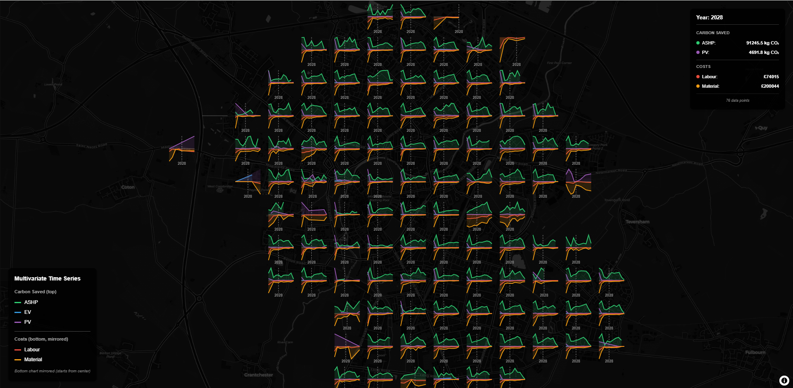

# ScreenGrid Library v2.0

[](https://www.npmjs.com/package/screengrid)

A GPU/Canvas hybrid Screen-Space Grid Aggregation library for MapLibre GL JS. This library provides efficient real-time aggregation of point data into screen-space grids with customizable styling, interactive features, and advanced glyph drawing capabilities.



## 🚀 Features

- **Real-time Aggregation**: Efficiently aggregates point data into screen-space grids
- **Customizable Styling**: Flexible color scales and cell sizing
- **Interactive Events**: Hover and click handlers for grid cells
- **Glyph Drawing**: Custom glyph rendering with Canvas 2D for advanced visualizations
- **MapLibre Integration**: Seamless integration with MapLibre GL JS
- **Performance Optimized**: Uses Canvas 2D rendering for optimal performance
- **Responsive Design**: Automatically adjusts to map viewport changes
- **Zoom-based Sizing**: Dynamic cell size adjustment based on zoom level
- **Multi-attribute Visualization**: Support for visualizing multiple data attributes per cell

## 📁 Project Structure

```
screengrid/
├── src/
│   ├── index.js                    # Main entry point
│   ├── ScreenGridLayerGL.js        # Main orchestrator class
│   ├── config/ConfigManager.js     # Configuration management
│   ├── core/                       # Core business logic (pure)
│   │   ├── Aggregator.js
│   │   ├── Projector.js
│   │   └── CellQueryEngine.js
│   ├── canvas/                     # Canvas rendering
│   │   ├── CanvasManager.js
│   │   └── Renderer.js
│   ├── events/                     # Event system
│   │   ├── EventBinder.js
│   │   └── EventHandlers.js
│   ├── glyphs/GlyphUtilities.js    # Glyph drawing utilities
│   └── legend/                     # Legend system
│       ├── Legend.js
│       ├── LegendDataExtractor.js
│       └── LegendRenderers.js
├── dist/                           # Built distribution files
├── docs/
│   ├── ARCHITECTURE.md             # Detailed architecture guide
│   ├── USAGE.md                    # Detailed usage guide
│   └── README.md
├── examples/
│   ├── index.html
│   ├── simple-test.html
│   ├── test.html
│   ├── legend-example.html
│   ├── timeseries.html
│   └── multivariate-timeseries.html
├── package.json
└── rollup.config.mjs
```

## 🚀 Quick Start

### Installation

```bash
# From npm
npm install screengrid

# Peer dependency (you manage this in your app)
npm install maplibre-gl

# Or clone the repository for development
git clone https://github.com/danylaksono/screengrid.git
cd screengrid
npm install
npm run build

# To run examples locally, use a simple HTTP server:
npx http-server -p 8000
# Then open http://localhost:8000/examples/ in your browser
```

### Basic Usage

```javascript
// ESM (bundlers / modern Node)
import { ScreenGridLayerGL } from 'screengrid';
import maplibregl from 'maplibre-gl';

// Initialize MapLibre map
const map = new maplibregl.Map({
  container: 'map',
  style: 'https://demotiles.maplibre.org/style.json',
  center: [-122.4, 37.74],
  zoom: 11
});

map.on('load', async () => {
  // Load your data
  const data = await fetch('your-data.json').then(r => r.json());
  
  // Create grid layer
  const gridLayer = new ScreenGridLayerGL({
    data: data,
    getPosition: (d) => d.coordinates,
    getWeight: (d) => d.weight,
    cellSizePixels: 60,
    colorScale: (v) => [255 * v, 200 * (1 - v), 50, 220]
  });
  
  // Add to map
  map.addLayer(gridLayer);
});
```

### CommonJS (Node or older bundlers)

```javascript
// CJS require
const { ScreenGridLayerGL } = require('screengrid');
const maplibregl = require('maplibre-gl');
```

### CDN Usage

```html
<!-- UMD build exposes global `ScreenGrid` -->
<script src="https://unpkg.com/screengrid/dist/screengrid.umd.min.js"></script>
<!-- MapLibre (peer) must also be included on the page -->
<link href="https://unpkg.com/maplibre-gl@^4/dist/maplibre-gl.css" rel="stylesheet" />
<script src="https://unpkg.com/maplibre-gl@^4/dist/maplibre-gl.js"></script>
<script>
  const { ScreenGridLayerGL } = ScreenGrid;
  // use ScreenGridLayerGL here
  // ...
  // map.addLayer(new ScreenGridLayerGL({...}))
</script>
```

### Full Example (CDN)

```html
<div id="map" style="position:absolute;top:0;bottom:0;width:100%"></div>
<link href="https://unpkg.com/maplibre-gl@^4/dist/maplibre-gl.css" rel="stylesheet" />
<script src="https://unpkg.com/maplibre-gl@^4/dist/maplibre-gl.js"></script>
<script src="https://unpkg.com/screengrid/dist/screengrid.umd.min.js"></script>
<script>
  const map = new maplibregl.Map({
    container: 'map',
    style: 'https://demotiles.maplibre.org/style.json',
    center: [-122.4, 37.74],
    zoom: 11
  });

  map.on('load', async () => {
    const data = await fetch('your-data.json').then(r => r.json());
    const layer = new ScreenGrid.ScreenGridLayerGL({
      data,
      getPosition: d => d.coordinates,
      getWeight: d => d.weight,
      cellSizePixels: 60,
      colorScale: v => [255 * v, 200 * (1 - v), 50, 220]
    });
    map.addLayer(layer);
  });
  
  // Optional: hover/click handlers
  // layer.setConfig({ onHover: ({cell}) => console.log(cell) });
</script>
```

### Bundles

- ESM: `dist/screengrid.mjs`
- CJS: `dist/screengrid.cjs`
- UMD: `dist/screengrid.umd.js`
- UMD (min): `dist/screengrid.umd.min.js`

`maplibre-gl` is a peer dependency and is not bundled. In UMD builds, it is expected as a global `maplibregl`.                                                                                                                                             
## 🎨 Glyph Drawing

The library supports custom glyph drawing through the `onDrawCell` callback. This enables rich multivariate visualizations including time series, categorical breakdowns, and complex relationships.

📖 **📚 Comprehensive Guide**: See [docs/GLYPH_DRAWING_GUIDE.md](./docs/GLYPH_DRAWING_GUIDE.md) for detailed documentation on:
- All built-in glyph utilities (8 types including time series)
- Custom glyph implementation patterns
- Multivariate data visualization techniques
- Time series and spatio-temporal visualization
- Advanced patterns and best practices

### Quick Example

```javascript
const gridLayer = new ScreenGridLayerGL({
  data: bikeData,
  getPosition: (d) => d.COORDINATES,
  getWeight: (d) => d.SPACES,
  enableGlyphs: true,
  onDrawCell: (ctx, x, y, normVal, cellInfo) => {
    const { cellData, glyphRadius } = cellInfo;
    
    // Calculate aggregated values
    const totalRacks = cellData.reduce((sum, item) => sum + item.data.RACKS, 0);
    const totalSpaces = cellData.reduce((sum, item) => sum + item.data.SPACES, 0);
    
    // Draw custom glyph
    ctx.fillStyle = `hsl(${200 + normVal * 60}, 70%, 50%)`;
    ctx.beginPath();
    ctx.arc(x, y, glyphRadius, 0, 2 * Math.PI);
    ctx.fill();
    
    // Add text
    ctx.fillStyle = '#ffffff';
    ctx.font = 'bold 12px Arial';
    ctx.textAlign = 'center';
    ctx.fillText(totalSpaces.toString(), x, y);
  }
});
```

## 📚 Examples

### Running the Examples

To run the examples locally:

```bash
npx http-server -p 8000
# Then open http://localhost:8000/examples/ in your browser
```

### Available Examples

1. **Full Demo** (`examples/index.html`) - Complete interactive demo with all features
2. **Simple Test** (`examples/simple-test.html`) - Basic functionality verification
3. **Original Test** (`examples/test.html`) - Original test implementation
4. **Legend Example** (`examples/legend-example.html`) - Demonstrates legend functionality
5. **Time Series** (`examples/timeseries.html`) - Temporal data visualization
6. **Multivariate Time Series** (`examples/multivariate-timeseries.html`) - Advanced multi-attribute temporal visualization

### Example Features

- **Multiple Data Sources**: SF Bike Parking, Restaurants, NYC Taxis
- **Visualization Modes**: Color-based and Glyph-based rendering
- **Interactive Controls**: Real-time parameter adjustment
- **Live Preview**: Glyph preview and real-time updates
- **Legend Support**: Dynamic legend generation for various visualization types
- **Time Series**: Temporal data aggregation and visualization
- **Debug Information**: Console logging and status updates

## 🔧 API Reference

### ScreenGridLayerGL

#### Constructor Options

| Option | Type | Default | Description |
|--------|------|---------|-------------|
| `id` | string | `"screen-grid-layer"` | Unique identifier for the layer |
| `data` | Array | `[]` | Array of data points to aggregate |
| `getPosition` | Function | `(d) => d.coordinates` | Function to extract coordinates from data |
| `getWeight` | Function | `() => 1` | Function to extract weight from data |
| `cellSizePixels` | number | `50` | Size of each grid cell in pixels |
| `colorScale` | Function | `(v) => [255 * v, 100, 200, 200]` | Color scale function |
| `onAggregate` | Function | `null` | Callback when grid is aggregated |
| `onHover` | Function | `null` | Callback when hovering over cells |
| `onClick` | Function | `null` | Callback when clicking cells |
| `onDrawCell` | Function | `null` | Callback for custom glyph drawing |
| `enableGlyphs` | boolean | `false` | Enable glyph-based rendering |
| `glyphSize` | number | `0.8` | Size of glyphs relative to cell size |
| `adaptiveCellSize` | boolean | `false` | Enable adaptive cell sizing |
| `minCellSize` | number | `20` | Minimum cell size in pixels |
| `maxCellSize` | number | `100` | Maximum cell size in pixels |
| `zoomBasedSize` | boolean | `false` | Adjust cell size based on zoom level |
| `enabled` | boolean | `true` | Whether the layer is enabled |

## 🛠️ Built-in Glyph Utilities

```javascript
// Circle glyph
ScreenGridLayerGL.drawCircleGlyph(ctx, x, y, radius, color, alpha);

// Bar chart glyph
ScreenGridLayerGL.drawBarGlyph(ctx, x, y, values, maxValue, cellSize, colors);

// Pie chart glyph
ScreenGridLayerGL.drawPieGlyph(ctx, x, y, values, radius, colors);

// Scatter plot glyph
ScreenGridLayerGL.drawScatterGlyph(ctx, x, y, points, cellSize, color);

// Donut chart glyph (v2.0.0+)
ScreenGridLayerGL.drawDonutGlyph(ctx, x, y, values, outerRadius, innerRadius, colors);

// Heatmap intensity glyph (v2.0.0+)
ScreenGridLayerGL.drawHeatmapGlyph(ctx, x, y, radius, normalizedValue, colorScale);

// Radial bar chart glyph (v2.0.0+)
ScreenGridLayerGL.drawRadialBarGlyph(ctx, x, y, values, maxValue, maxRadius, color);
```

## 📊 Legend Module

The library includes a powerful Legend module for automatically generating data-driven legends:

```javascript
import { Legend } from 'screengrid';

// Create a legend connected to your grid layer
const legend = new Legend({
  layer: gridLayer,
  type: 'auto', // 'color-scale', 'categorical', 'temporal', 'size-scale', 'auto', 'multi'
  position: 'bottom-right', // 'top-left', 'top-right', 'bottom-left', 'bottom-right'
  title: 'Data Legend'
});

// The legend automatically updates when the grid is aggregated
```

### Legend Types

- **`color-scale`**: Continuous color scale legend
- **`categorical`**: Categorical/discrete values legend
- **`temporal`**: Time-based legend for temporal data
- **`size-scale`**: Size-based legend
- **`auto`**: Automatically detects the best legend type
- **`multi`**: Multi-attribute legend for complex visualizations

See `examples/legend-example.html` for detailed usage examples.

## 🐛 Troubleshooting

### Common Issues

1. **Grid not visible**: Check browser console for errors, ensure data is loaded correctly
2. **Glyphs not rendering**: Verify `enableGlyphs: true` and `onDrawCell` callback is provided
3. **Performance issues**: Try increasing cell size or reducing data points
4. **Canvas issues**: Ensure MapLibre GL JS is properly loaded

### Debug Mode

Enable debug logging by opening browser console. The library provides detailed logging for:
- Layer initialization
- Data aggregation
- Rendering process
- Error states

## 👤 Author

**dany laksono**

## 📄 License

MIT License - see LICENSE file for details.

## 🤝 Contributing

1. Fork the repository
2. Create a feature branch
3. Make your changes
4. Add tests if applicable
5. Submit a pull request

## 📝 Changelog

### v2.0.0
- **NEW**: Comprehensive modular refactoring (11 modules with clean separation of concerns)
- **NEW**: Core modules for pure business logic (Aggregator, Projector, CellQueryEngine) - zero UI dependencies
- **NEW**: Dedicated canvas management (CanvasManager, Renderer) - clean rendering pipeline
- **NEW**: Organized event system (EventBinder, EventHandlers) - testable event logic
- **NEW**: Configuration management system (ConfigManager)
- **NEW**: Glyph drawing system with `onDrawCell` callback
- **NEW**: 7 built-in glyph utilities (circle, bar, pie, scatter, donut, heatmap, radial bar)
- **NEW**: Enhanced aggregation storing raw data points per cell
- **NEW**: Zoom-based cell size adjustment
- **NEW**: Adaptive cell sizing options
- **NEW**: Multi-attribute visualization support
- **NEW**: Grid statistics method (`getStats()`)
- **NEW**: Spatial query methods (`getCellsInBounds()`, `getCellsAboveThreshold()`)
- **IMPROVED**: Enhanced cell interaction with detailed data access
- **IMPROVED**: Better performance with optimized rendering pipeline
- **IMPROVED**: Modular architecture enables better testing and reusability
- **IMPROVED**: Comprehensive documentation with architecture guide

### v1.0.0
- Initial release
- Basic grid aggregation functionality
- MapLibre GL JS integration
- Interactive hover and click events
- Customizable styling options


## Future Plans

### Short-term
1. Add unit tests for each module
2. Add integration tests
3. Create CI/CD pipeline for testing
4. Consider TypeScript definitions

### Long-term
1. Plugin system for custom glyphs
2. WebGL renderer alternative
3. Server-side aggregation
4. Framework bindings (React, Vue)
5. Performance optimizations


